# Using a Raspberry Pi 400 with Ubunutu Desktop 64-bit

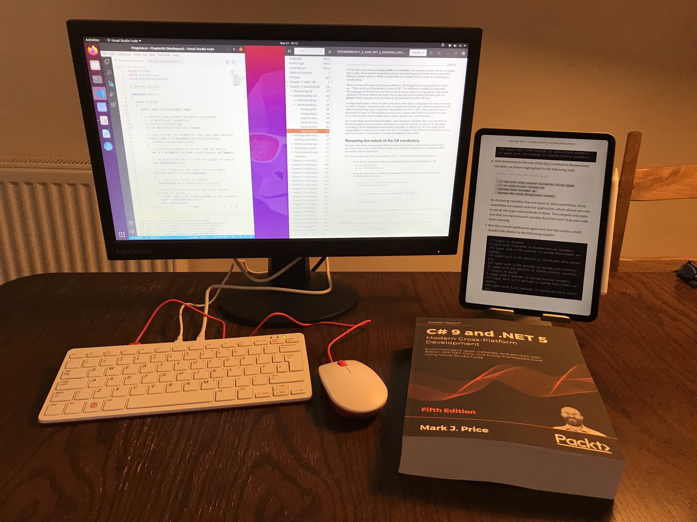

## Easy As Pi
[Raspberry Pi 400](https://www.raspberrypi.org/blog/raspberry-pi-400-the-70-desktop-pc/) was launched on 2 November 2020. The Raspi has been around for ages but this is the first time its been embedded in a keyboard. A desktop PC for $70? Yes, please!

Since I like things to be as easy as possible, I ordered the $100 model with all the useful extras like power adapter, mouse, and HDMI cable. All I needed to add was a monitor so I also bought a cheap Lenovo LCD.

## About the OS
Raspberry Pi OS is the official supported operating system but it is 32-bit even though the CPU is a quad-core Cortex-A72 (ARM v8) 64-bit SoC @ 1.8GHz and 4GB of RAM.

In this article I explain how to set up Ubuntu Desktop 64-bit. If you would rather just use the default 32-bit OS then I wrote an [article](../raspberry-pi-os32/README.md) about how to do that.

## Creating a boot disk using Raspberry Pi Imager

You will need a microSD card reader/writer and a microSD card with at least 8GB capacity. For example, I used an Atolla adapter and a 32GB SanDisk card, as shown in the following photos:

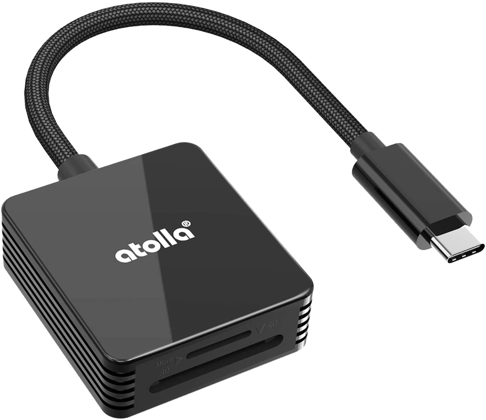
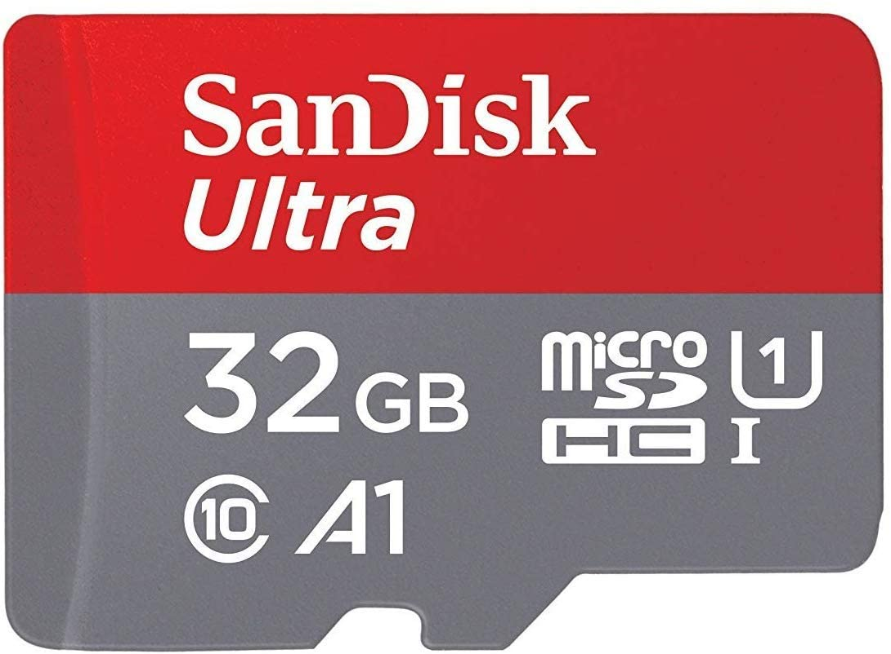

1. Start your favorite browser on your computer. I used my 13-inch MacBook Pro.
2. Navigate to https://www.raspberrypi.org/software/
3. Download and install Raspberry Pi Imager. You can read [more about this tool](https://www.raspberrypi.org/blog/raspberry-pi-imager-imaging-utility/) on the Raspberry Pi website.
4. Put the SD card you'll use with your Raspberry Pi into the reader and run Raspberry Pi Imager.
5. In Raspberry Pi Imager, select the operating system that you want to use. I chose `Ubuntu Desktop 20.10 (RPi 4/400)`, as shown in the following screenshot:

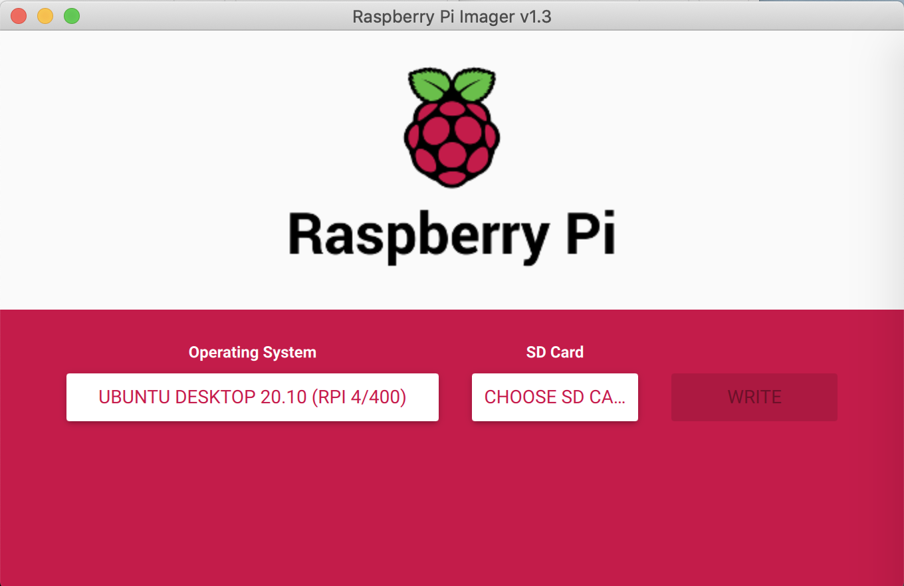

6. Select the SD card.
7. Click the `Write` button.
8. When the writing has finished you will see a success message, as shown in the following screenshot:

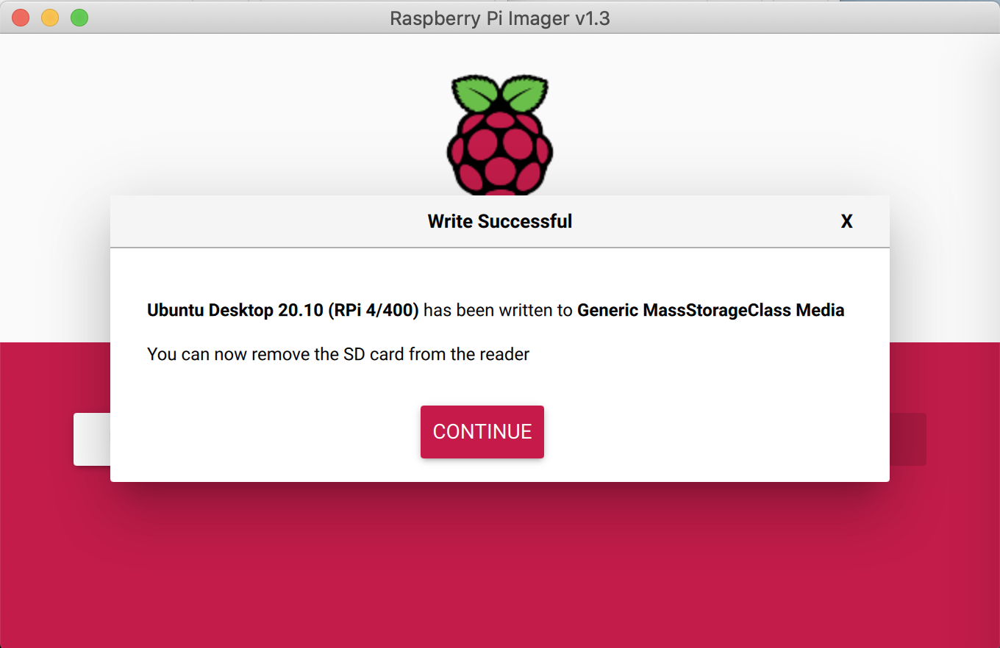

9. Click `Continue`.
10. Close the Raspberry Pi Imager app.

## Booting into Groovy Gorilla
Groovy Gorilla is the current version of Ubuntu and we are going to use the version created specfically for the Raspberry Pi.

## Installing .NET 5 SDK and Visual Studio Code

1. Start Firefox. This is the default browser on Ubuntu.
2. Navigate to https://dotnet.microsoft.com/download/dotnet/5.0
3. In the `Build apps - SDK` column, in the `Linux` row and `Binaries` column, click `Arm64`, as shown in the following screenshot:

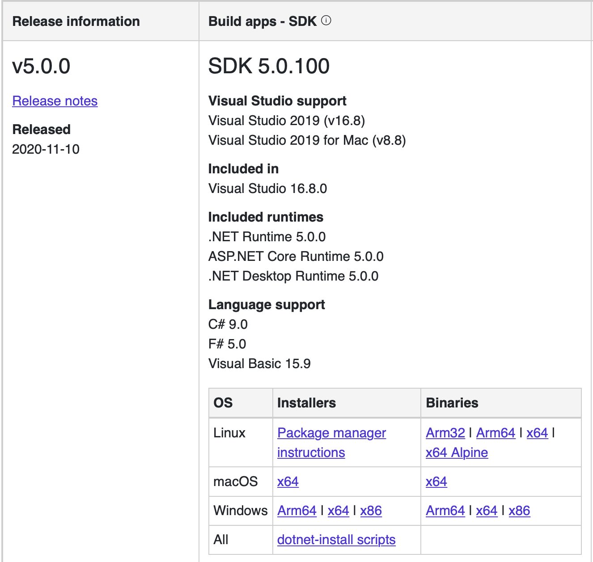

4. Navigate to https://code.visualstudio.com/download
5. Underneath the main icons for Linux, in the `.deb` row, click the ARM64 button, as shown in the following screenshot:

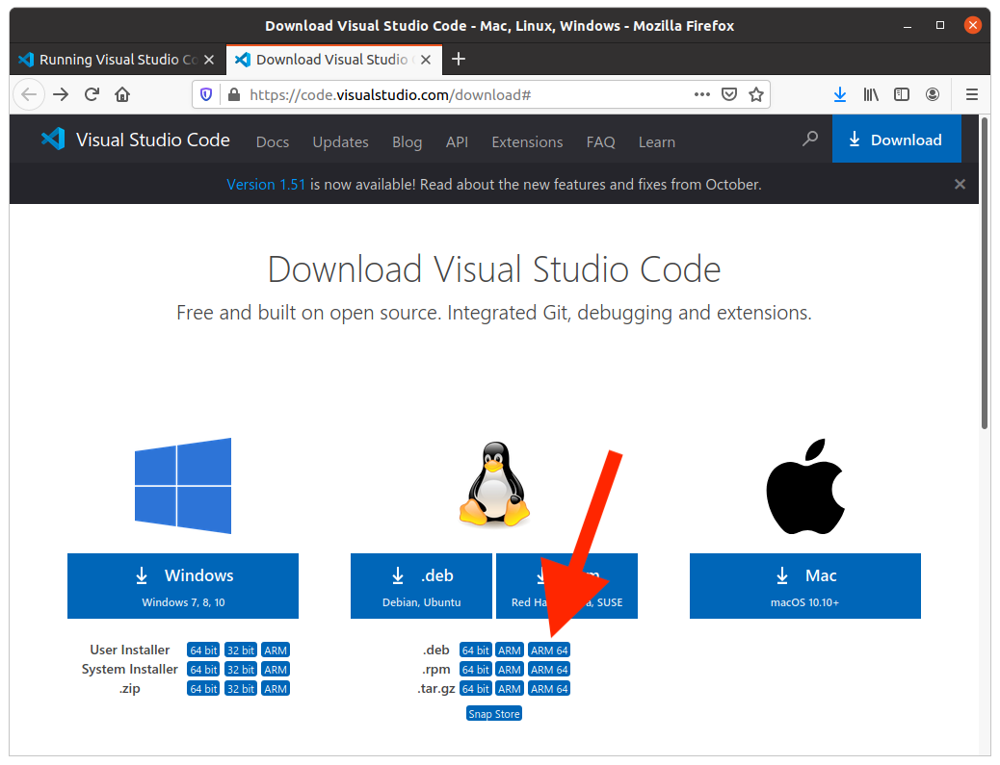

4. View your `Downloads` folder, as shown in the following screenshot:

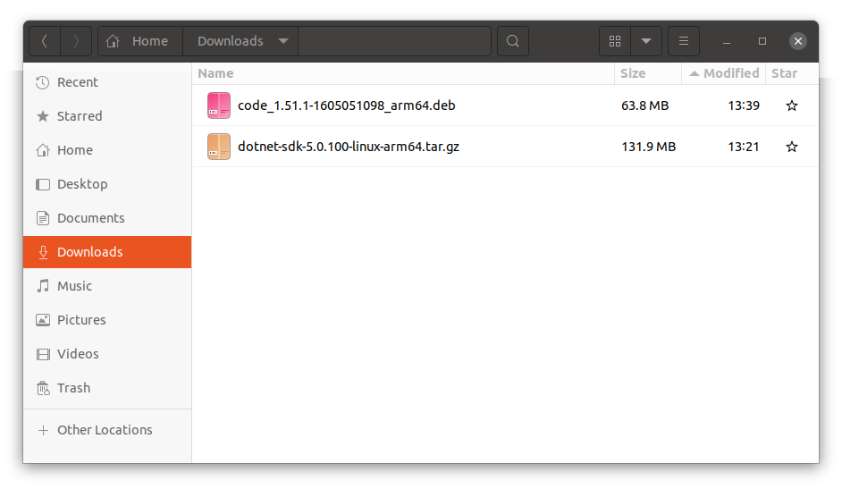

5. Double-click the `code_1.51.xxxx.deb` file.
6. Click the `Install` button, as shown in the following screenshot:

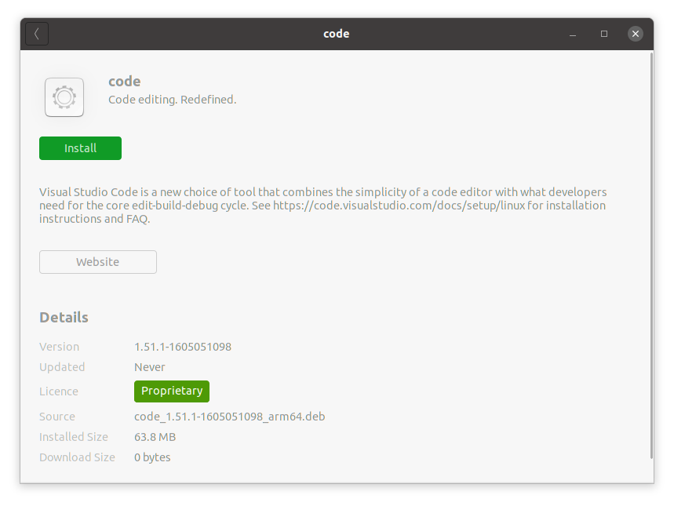

7. Start Visual Studio Code, as shown in the following screenshot:

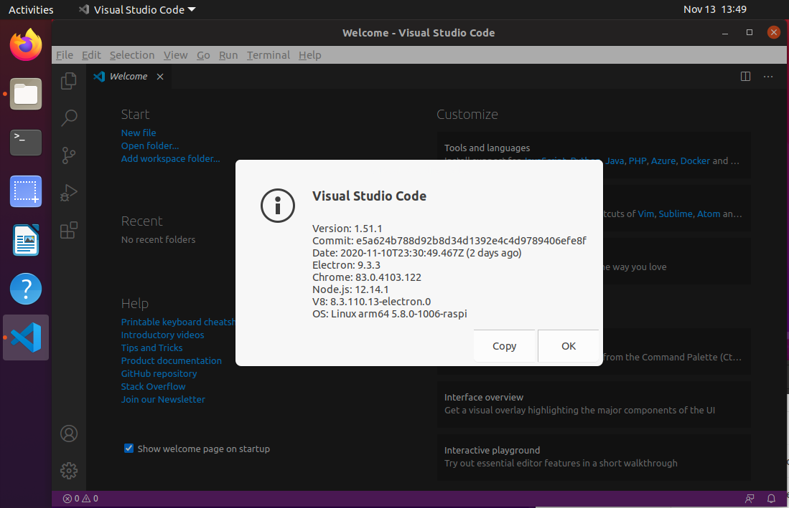

8. Follow the book instructions to write code and see it run in the Terminal window of Visual Studio Code, as shown in the following screenshot:

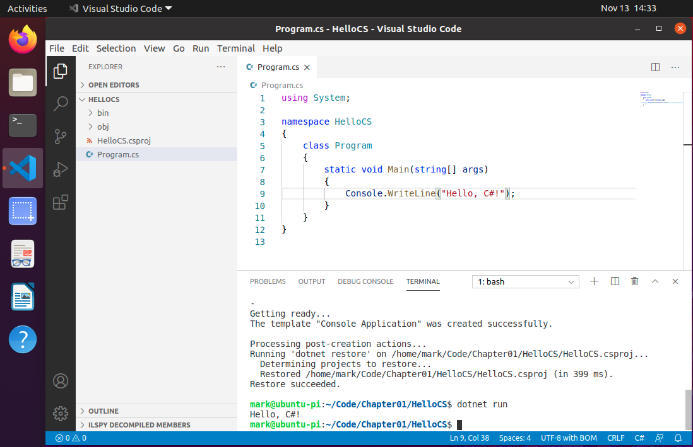

8. Follow the book instructions to clone the book's GitHub repository, as shown in the following screenshot:

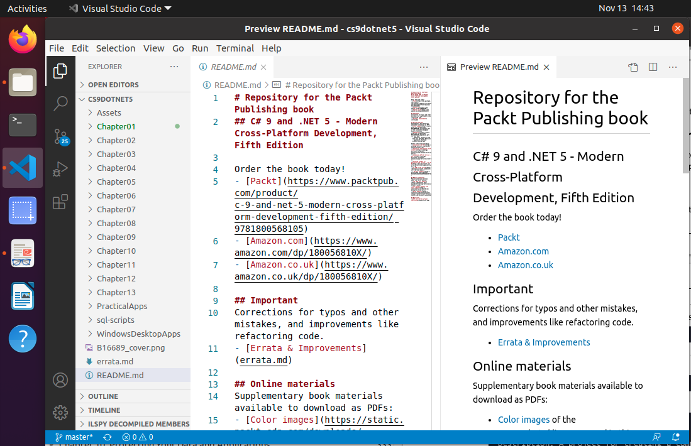

## Limitations
Currently the C# extension cannot provider IntelliSense as you type. This is because it uses the OmniSharp language service and that is not (yet) compatible with ARM. 

This means that as you type code, you won't get any help with suggestions. But *real* programmers don't need IntelliSense, right? ;-)

Sadly, you also won't be able to use debugging tools or get help from the MSBuild project extension either, as shown in the following screenshot:

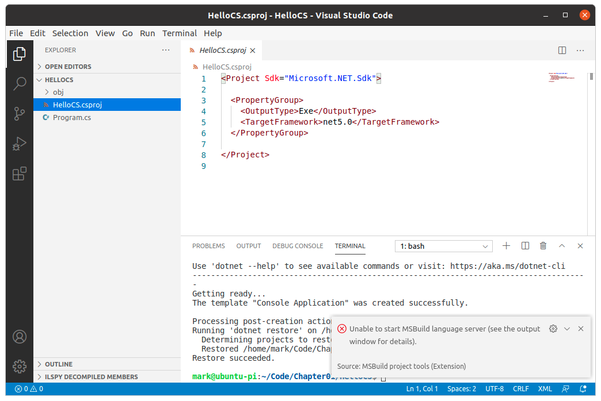

I will update this section as support is added.